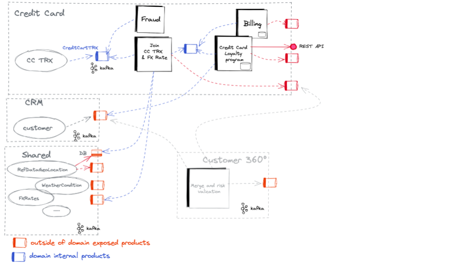
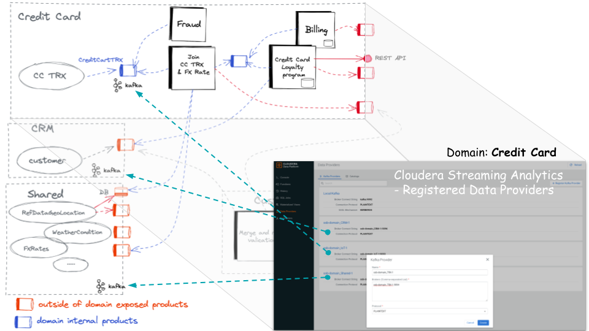
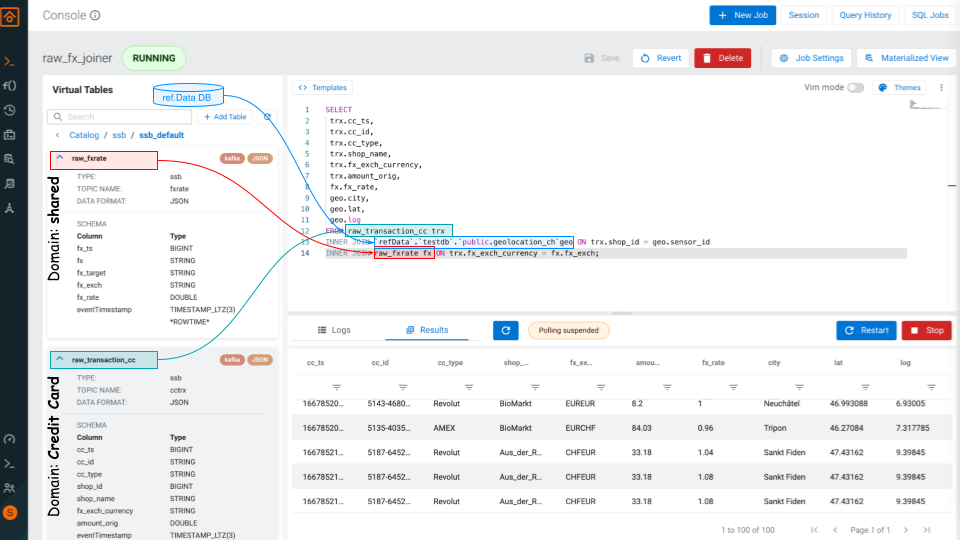

# Event Mesh
Data mesh has been one of the trendy buzzwords for several years now, but what does it mean exactly?
The mesh paradigm is a design concept and organizational approach that aims to manage data in a distributed manner across the enterprise, so it is not a technical implementation.

Analyst firm Gartner describes data mesh as an architecture designed with “the specific goal of building business-focused data products”.

In our case we will use the following scenario:



## Pre-Requisites
Install required software:
- install **_docker-compose_** [https://docs.docker.com/compose/install/](https://docs.docker.com/compose/install/)
- install **_CSP Community Edition_** [https://docs.cloudera.com/csp-ce/latest/installation/topics/csp-ce-installing-ce](https://docs.cloudera.com/csp-ce/latest/installation/topics/csp-ce-installing-ce.html)


## In case you want to recreate the two container images
```
git clone https://github.com/zBrainiac/event-mesh.git

# build multi-arch images amd64 & arm64
docker buildx build --platform linux/amd64,linux/arm64 -f dockerfile-event-mesh --tag brainiac/event-mesh:0.0.1 --push .
docker buildx build --platform linux/amd64,linux/arm64 -f dockerfile-event-mesh-refdata --tag brainiac/event-mesh-refdata:0.0.1 --push .
```


## How to usage
### start via docker-compose 


```
cd <CSA-CE install dir>
wget https://raw.githubusercontent.com/zBrainiac/event-mesh/main/docker-compose-event-mesh.yml

# start CSA CE
docker-compose -f docker-compose.yml up -d --scale flink-taskmanager=2

# start all data mesh domains:
docker-compose -f docker-compose-event-mesh.yml up -d

# If you are only interested in individual domains, you can also start them individually.
docker-compose -f docker-compose-event-mesh_IoT.yml up -d 

# or all kafka producers send their event directly into the Kafka broker of CSP CE.
docker-compose -f docker-compose-event-mesh_no_domain.yml up -d
```

## SQL Stream Builder

### Data Providers > Register Kafka Provider
In order to access external Kafka brokers, they must be registered as 'Data Providers' in CSP CE.



| Domain | Broker Connect String | Connection Protocol |
|--------|-----------------------|---------------------|
| ssb-domain_Shared-1 | ssb-domain_Shared-1:9095 | PLAINTEXT |
| ssb-domain_IoT-1 | ssb-domain_IoT-1:9093 | PLAINTEXT |
| ssb-domain_TRX-1 | ssb-domain_TRX-1:9094 | PLAINTEXT |
| ssb-domain_CRM-1 | ssb-domain_CRM-1:9096 | PLAINTEXT |


### Data Providers > Catalogs > CatalogType > Custom
External databases can also be registered as 'Data Providers' in CSP CE.

``` 
Property Key for 'refdata' lookup table hosted in the shared domain
base-url = jdbc:postgresql://domain_shared-refdata:5432
type = jdbc
username = postgres
password = Supersecret1
default-database = testdb
```


### Run some SQL 
switch to the SQL console

As a next step, a table must be created for each Kafka topic so that the SQL can be used later.
Note that the `properties.bootstrap.servers` uses the previously registered 'Data Providers'.

In our case the 'Data Providers' are: `'ssb-domain_TRX-1:9094'` or `'ssb-domain_Shared-1:9095'`

DDL for Tables:
```
CREATE TABLE `ssb`.`ssb_default`.`raw_transaction_cc` (
  `cc_ts` BIGINT,
  `cc_id` VARCHAR(2147483647),
  `cc_type` VARCHAR(2147483647),
  `shop_id` BIGINT,
  `shop_name` VARCHAR(2147483647),
  `fx_exch_currency` VARCHAR(2147483647),
  `amount_orig` DOUBLE,
  `eventTimestamp` TIMESTAMP(3) WITH LOCAL TIME ZONE METADATA FROM 'timestamp',
  WATERMARK FOR `eventTimestamp` AS `eventTimestamp` - INTERVAL '3' SECOND
) WITH (
  'scan.startup.mode' = 'group-offsets',
  'properties.request.timeout.ms' = '120000',
  'properties.auto.offset.reset' = 'earliest',
  'format' = 'json',
  'properties.bootstrap.servers' = 'ssb-domain_TRX-1:9094',
  'connector' = 'kafka',
  'properties.transaction.timeout.ms' = '900000',
  'topic' = 'cctrx',
  'properties.group.id' = 'raw_transaction_cc'
)


CREATE TABLE `ssb`.`ssb_default`.`raw_fxrate` (
  `fx_ts` BIGINT,
  `fx` VARCHAR(2147483647),
  `fx_target` VARCHAR(2147483647),
  `fx_exch` VARCHAR(2147483647),
  `fx_rate` DOUBLE,
  `eventTimestamp` TIMESTAMP(3) WITH LOCAL TIME ZONE METADATA FROM 'timestamp',
  WATERMARK FOR `eventTimestamp` AS `eventTimestamp` - INTERVAL '3' SECOND
) WITH (
  'scan.startup.mode' = 'earliest-offset',
  'properties.request.timeout.ms' = '120000',
  'properties.auto.offset.reset' = 'earliest',
  'format' = 'json',
  'properties.bootstrap.servers' = 'ssb-domain_Shared-1:9095',
  'connector' = 'kafka',
  'properties.transaction.timeout.ms' = '900000',
  'topic' = 'fxrate'
)
```
After we have created all the 'Data Providers' and associated table definitions (DDL), we can start queries across domains using standard SQL.



```
SELECT
 trx.cc_ts,
 trx.cc_id,
 trx.cc_type,
 trx.shop_name,
 trx.fx_exch_currency,
 trx.amount_orig,
 fx.fx_rate,
 geo.city,
 geo.lat,
 geo.log
FROM raw_transaction_cc trx
INNER JOIN `refData`.`testdb`.`public.geolocation_ch`geo ON trx.shop_id = geo.sensor_id  
INNER JOIN raw_fxrate fx ON trx.fx_exch_currency = fx.fx_exch;
```

To publish merged events into a new created topic `int-cctrx-fx-enriched`
on the local Kafka Broker `kafka:9092`

DDL for creating sink table/Kafka out:
```
CREATE TABLE  `sink_int_cctrx_fx_enriched` (
  `cc_ts` BIGINT,
  `cc_id` VARCHAR(2147483647),
  `cc_type` VARCHAR(2147483647),
  `shop_name` VARCHAR(2147483647),
  `fx_exch_currency` VARCHAR(2147483647),
  `amount_orig` DOUBLE,
  `fx_rate` DOUBLE,
  `city` VARCHAR(255),
  `lat` FLOAT,
  `log` FLOAT
) WITH (
  'connector' = 'kafka: Local Kafka',
  'format' = 'json', 
  'scan.startup.mode' = 'group-offsets', 
  'topic' = 'int-cctrx-fx-enriched'
);
```

Adjusted SQL to insert result into newly created table:

```
INSERT INTO `sink_int_cctrx_fx_enriched` 
SELECT
 trx.cc_ts,
 trx.cc_id,
 trx.cc_type,
 trx.shop_name,
 trx.fx_exch_currency,
 trx.amount_orig,
 fx.fx_rate,
 geo.city,
 geo.lat,
 geo.log
FROM raw_transaction_cc trx
INNER JOIN `refData`.`testdb`.`public.geolocation_ch`geo ON trx.shop_id = geo.sensor_id  
INNER JOIN raw_fxrate fx ON trx.fx_exch_currency = fx.fx_exch;
```